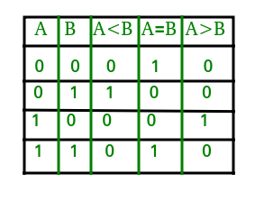

<h1 align="center">
   
  
   
  verilog code
   
</h1>

<h4 align="center">Verilog Codes For Various Chipsets</h3>

## Contents 

 - [ICs Codes](#ics-codes)
 - [Truth Table & Circuit Diagrams](#truth-table-circuit-diagrams)

## ICs Codes

- [AND Gate](code/and_g.v)

- [NOT Gate](code/not_g.v)

- [NOR Gate](code/nor_g.v)

- [NAND Gate](code/nand_g.v)

- [NAND Gate Using Structural](code/structural_nand.v)

- [All Basic Gate](code/all_basic_gates.v)

- [NOT To OR Gate](code/not_to_or.v)

- [NAND To NOT Gate](code/nand_to_not.v)

- [Half Adder via Data Flow](code/half_adder_data_flow.v)

- [Half Adder via Gate Flow](code/half_adder_gate_flow.v)

- [Full Adder via Data Flow](code/full_adder_data_flow.v)

- [Full Adder via Gate Flow](code/full_adder_gate_flow.v)

- [Full Adder Using Mux 4:1](code/full_adder_using_mux41.v)

- [Half Subtractor via Data Flow](code/half_subtractor_data_flow.v)

- [Half Subtractor via Gate Flow](code/half_subtractor_gate_flow.v)

- [Half Adder Using Decoder](code/half_adder_using_decoder.v)

- [Full Subtractor via Data Flow](code/full_subtractor_data_flow.v)

- [Full Subtractor via Gate Flow](code/full_subtractor_gate_flow.v)

- [2:1 Mux via Data FLow](code/mux21_data_flow.v)

- [4:1 Mux via Data Flow](code/mux41_data_flow.v)

- [4:1 Mux via Gate Flow](code/mux41_gate_flow.v)

- [4:1 Mux Conditional Operator](code/mux41_cond.v)

- [2:1 Mux Conditional Operator](code/mux21_cond.v)

- [Binary To Graycode Converter](code/binary_to_graycode_vector.v)

- [Graycode to Binary Converter](code/graycode_to_binary_4bit.v)

- [Decoder 2:4](code/decoder_24.v)

- [Decoder 3:8](code/decoder38.v)

- [Multiplier 2x2 Data Flow](code/mul22_data_flow.v)

- [Multiplier 2x2 using Half Adder](code/multiplier2x2.v)

- [4 bit Ripple Carry Adder](code/ripple_carry_adder_4bit.v)

- [4 bit Adder Cum Subtractor](code/adder_cum_sub_4bit.v)

- [4 bit Adder Cum Subtractor Using Full Adder](code/adder_cum_sub_4bit_fh.v)

- [3 bit Even Parity Generator](code/even_parity_3bit.v)

- [6 bit Even Parity Generator](code/even_parity_6bit.v)

- [6 bit Odd Parity Generator](code/odd_parity_6bit.v)

- [1 bit Magnitude Comparator](code/mag_comp_1bit.v)

- [Expression-1 : (ac((~a)b)+ab(~c)) ](code/expression-1.v)

- [Expression-2 : (~a)(~b) + abc + (~a)b(~c)](code/expression-2.v)

- [Expression-3 : a(~b) + ab(~c) + (~b)c ( using 3:8 Decoder)](code/exp_using_decoder38.v)

- [Expression-4 : πm (1,3,5) +d(0,4) using gate level](code/expression-4.v)

## Truth Table Circuit Diagrams

- Half Adder

	- Truth Table

	

	- Circuit Diagram

	

	Image Credit : 
		[wikipedia](https://en.wikipedia.org/wiki/Adder_(electronics))

- Full Adder

	- Truth Table

	

	- Circuit Diagram
	
	

	Image Credit : 
		[GeeksforGeeks](https://www.geeksforgeeks.org/full-adder-in-digital-logic/) &
		[Wikipedia](https://en.wikipedia.org/wiki/Adder_(electronics))

- Half Subtractor

	- Truth Table

	

	- Circuit Diagram
	
	

	Image Credit : 
		[GeeksforGeeks](https://www.geeksforgeeks.org/half-subtractor-in-digital-logic/)

- Full Subtractor

	- Truth Table

	

	- Circuit Diagram
	
	

	Image Credit : 
		[GeeksforGeeks](https://www.geeksforgeeks.org/full-subtractor-in-digital-logic/) &
		[Circuit Digest](https://circuitdigest.com/tutorial/full-subtractor-circuit-and-its-construction)

- 2x1 MUX 

	- Truth Table

	

	Image Credit : 
		[GeeksforGeeks](https://www.geeksforgeeks.org/multiplexers-in-digital-logic/)

- 4x1 MUX

	- Truth Table

	

	- Circuit Diagram
	
	

	Image Credit : 
		[GeeksforGeeks](https://www.geeksforgeeks.org/multiplexers-in-digital-logic/)

- Binary To Graycode Converter

	- Truth Table

	

	- Circuit Diagram
	
	

	Image Credit : 
		[Tutorialspoint](https://www.tutorialspoint.com/conversion-of-binary-to-gray-code)

- Graycode to Binary Converter

	- Truth Table

	

	- Circuit Diagram
	
	

	Image Credit : 
		[Tutorialspoint](https://www.tutorialspoint.com/conversion-of-gray-code-to-binary)

- Ripple Carry Adder

	- Circuit Diagram
	
	

	Image Credit : 
		[Circuits Today](https://www.circuitstoday.com)

- 2x2 Multiplier

	- Truth Table & Circuit Diagram

	

	Image Credit : 
		[CS Washington](https://courses.cs.washington.edu)

- 2:4 Decoder

	- Truth Table

	

	- Circuit Diagram
	
	

	Image Credit : 
		[Elprocus](https://www.elprocus.com)

- 3:8 Decoder

	- Truth Table

	

	- Circuit Diagram
	
	

	Image Credit : 
		[Elprocus](https://www.elprocus.com)

- 1 Bit Magnitude Comparator

	- Truth Table

	

	- Circuit Diagram
	
	

	Image Credit : 
		[Elprocus](https://www.elprocus.com) & [GeeksforGeeks](https://www.geeksforgeeks.org/)

- Even Parity Generator

	- Truth Table

	

	- Circuit Diagram
	
	

	Image Credit : 
		[Elprocus](https://www.elprocus.com)